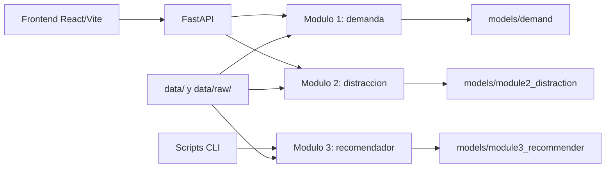

# Sistema Inteligente de Transporte

Proyecto academico de la Universidad Nacional de Colombia para integrar tres
modulos de aprendizaje profundo en una empresa de transporte:

1. Prediccion de demanda de pasajeros por ruta.
2. Clasificacion de comportamientos distractores de conductores.
3. Recomendacion personalizada de destinos de viaje.

El sistema combina modelos en PyTorch, una API en FastAPI y una interfaz web en
React/Vite para apoyar decisiones de planeacion operativa, seguridad vial y
personalizacion de la experiencia de viaje.

## Tabla de contenido

- [Resumen](#resumen)
- [Resultados principales](#resultados-principales)
- [Arquitectura](#arquitectura)
- [Estructura del repositorio](#estructura-del-repositorio)
- [Instalacion](#instalacion)
- [Ejecucion](#ejecucion)
- [API](#api)
- [Entrenamiento y evaluacion](#entrenamiento-y-evaluacion)
- [Datos y artefactos](#datos-y-artefactos)
- [Analisis exploratorio de datos](#analisis-exploratorio-de-datos)
- [Limitaciones](#limitaciones)
- [Documentacion](#documentacion)

## Resumen

El proyecto desarrolla un prototipo funcional de transporte inteligente con tres
capacidades:

| Modulo | Problema | Enfoque |
|---|---|---|
| Demanda | Predecir pasajeros por ruta hasta 30 dias | LSTM bidireccional con atencion temporal, embeddings de ruta y clima |
| Distraccion | Clasificar imagenes de cabina del conductor | Transfer learning con `mobilenet_v3_small` |
| Recomendacion | Sugerir destinos personalizados | Recomendador neuronal hibrido con embeddings de usuario/destino y variables de contenido |

La API y el frontend permiten probar los tres modulos: demanda, distraccion y
recomendacion. El recomendador esta integrado a la API y al frontend con un
formulario de preferencias para usuarios nuevos.

## Resultados principales

| Modulo | Metrica destacada | Resultado |
|---|---:|---:|
| Prediccion de demanda | MAPE global | 7.77% |
| Prediccion de demanda | RMSE global | 175.83 pasajeros |
| Conduccion distractiva | Accuracy | 94.78% |
| Conduccion distractiva | F1-score ponderado | 94.78% |
| Recomendacion | Recall@10 | 1.00 |
| Recomendacion | NDCG@10 | 0.604 |

Metricas por ruta para demanda:

| Ruta | RMSE | MAE | MAPE |
|---|---:|---:|---:|
| Bogotá - Medellín | 156.15 | 116.03 | 7.53% |
| Bogotá - Cali | 241.24 | 181.25 | 7.65% |
| Bogotá - Cartagena | 108.40 | 83.37 | 8.21% |
| Medellín - Cartagena | 196.47 | 143.69 | 7.23% |
| Cali - Barranquilla | 147.15 | 104.97 | 8.22% |

## Arquitectura



Capas principales:

| Capa | Ubicacion | Descripcion |
|---|---|---|
| Modelos | `src/module*_*/` | Arquitecturas, preprocesamiento, entrenamiento, evaluacion e inferencia |
| API | `api/` | Servicio FastAPI con routers para demanda y distraccion |
| Frontend | `web/` | Interfaz React/Vite con visualizaciones y formularios |
| Scripts | `scripts/` | Descarga de datos, entrenamiento, evaluacion y prediccion por CLI |
| Artefactos | `models/` | Checkpoints, metricas, scalers, encoders, historiales y figuras |
| Documentos | `docs/` | Reportes tecnicos por modulo y reporte general |

## Estructura del repositorio

```text
.
|-- api/                         # Backend FastAPI
|   |-- main.py
|   |-- dependencies.py
|   `-- routers/
|-- data/                        # Dataset sintetico de demanda y datos locales
|-- docs/                        # Reportes tecnicos
|-- models/                      # Modelos entrenados y metricas
|-- notebooks/                   # EDA por modulo
|   |-- 01_eda_demand.ipynb      # EDA de demanda
|   |-- 02_eda_images.ipynb      # EDA de distraccion
|   `-- 03_eda_recommender.ipynb # EDA de recomendacion
|-- scripts/                     # Entrenamiento, evaluacion, descarga y prediccion
|-- src/
|   |-- module1_demand/          # Prediccion de demanda
|   |-- module2_distraction/     # Clasificacion de distracciones
|   |-- module3_recommender/     # Recomendacion de destinos
|   `-- shared/                  # Utilidades base
|-- tests/                       # Tests unitarios e integracion
|-- web/                         # Frontend React/Vite
|-- Dockerfile
|-- description.md               # Enunciado del proyecto
`-- README.md
```

## Instalacion

Requisitos recomendados:

- Python 3.11
- Node.js 20 o superior
- npm
- GPU CUDA opcional para entrenamiento

Crear entorno e instalar dependencias Python:

```bash
python -m venv .venv
.venv\Scripts\activate
pip install -r api/requirements.txt
```

Instalar dependencias del frontend:

```bash
cd web
npm install
```

> Nota: para PyTorch puede ser conveniente instalar la variante CPU o CUDA desde
> las instrucciones oficiales segun el equipo disponible.

## Ejecucion

### Backend

Desde la raiz del repositorio:

```bash
uvicorn api.main:app --reload --host 0.0.0.0 --port 8000
```

La API queda disponible en:

- `http://localhost:8000`
- `http://localhost:8000/docs`

### Frontend

En otra terminal:

```bash
cd web
npm run dev
```

Por defecto Vite sirve la aplicacion en `http://localhost:5173`.

Si la API no esta en el mismo origen, configurar `VITE_API_URL`:

```bash
VITE_API_URL=http://localhost:8000 npm run dev
```

En PowerShell:

```powershell
$env:VITE_API_URL="http://localhost:8000"
npm run dev
```

### Docker

El `Dockerfile` empaqueta la API, el codigo fuente, los modelos y los datos:

```bash
docker build -t transporte-inteligente-api .
docker run --rm -p 8000:8000 transporte-inteligente-api
```

## API

Endpoints implementados:

| Metodo | Endpoint | Descripcion |
|---|---|---|
| `GET` | `/` | Estado general del sistema |
| `GET` | `/demand/metadata` | Metadata de rutas, clima, escaladores y modelo |
| `POST` | `/demand/predict` | Prediccion/pronostico de demanda de 1 a 30 dias |
| `GET` | `/distraction/health` | Estado del clasificador de distraccion |
| `GET` | `/distraction/classes` | Clases disponibles y medidas preventivas |
| `POST` | `/distraction/predict` | Clasificacion de una imagen subida |
| `GET` | `/recommender/health` | Estado del recomendador |
| `POST` | `/recommender/recommend` | Recomendacion basada en preferencias o usuario existente |

Ejemplo de pronostico de demanda:

```bash
curl -X POST http://localhost:8000/demand/predict \
  -H "Content-Type: application/json" \
  -d "{\"route_id\": 0, \"steps\": 30}"
```

Ejemplo de clasificacion de imagen:

```bash
curl -X POST http://localhost:8000/distraction/predict \
  -F "file=@ruta/a/imagen.jpg"
```

## Entrenamiento y evaluacion

### Modulo 1: demanda

Entrenar el modelo LSTM:

```bash
python src/module1_demand/train.py
```

Artefactos principales:

- `models/demand/best_model.pth`
- `models/demand/metrics.json`
- `models/demand/metrics_por_ruta.csv`
- `models/demand/predicciones_detalle.csv`
- `models/demand/*scaler.pkl`
- `models/demand/*encoder.pkl`

### Modulo 2: conduccion distractiva

Descargar datos recomendados desde Kaggle:

```bash
python scripts/download_data.py --module module2 --output-dir data/raw
```

Entrenar:

```bash
python scripts/train_module2_distraction.py \
  --data-dir data/raw/module2_distraction \
  --output-dir models/module2_distraction \
  --architecture mobilenet_v3_small \
  --epochs 16 \
  --batch-size 16
```

Evaluar:

```bash
python scripts/evaluate_module2_distraction.py \
  --data-dir data/raw/module2_distraction \
  --checkpoint models/module2_distraction/best_model.pth
```

Predecir por CLI:

```bash
python scripts/predict_module2_distraction.py \
  --checkpoint models/module2_distraction/best_model.pth \
  --image ruta/a/imagen.jpg
```

Clases del modelo entrenado:

- `other_activities`
- `safe_driving`
- `talking_phone`
- `texting_phone`
- `turning`

### Modulo 3: recomendador

Descargar datos recomendados desde Kaggle:

```bash
python scripts/download_data.py --module module3 --output-dir data/raw
```

Entrenar:

```bash
python scripts/train_module3_recommender.py \
  --data-dir data/raw/module3_recommender \
  --output-dir models/module3_recommender \
  --epochs 20 \
  --batch-size 256
```

Evaluar:

```bash
python scripts/evaluate_module3_recommender.py \
  --data-dir data/raw/module3_recommender \
  --checkpoint models/module3_recommender/best_model.pth
```

Generar recomendaciones:

```bash
python scripts/recommend_module3_destinations.py \
  --checkpoint models/module3_recommender/best_model.pth \
  --user-id 15 \
  --top-k 5
```

## Pruebas

Ejecutar todos los tests:

```bash
pytest
```

Ejecutar pruebas por carpeta:

```bash
pytest tests/unit
pytest tests/integration
```

## Datos y artefactos

### Demanda

El archivo `data/demanda_transporte.csv` contiene 7.500 registros sinteticos:

- 5 rutas interurbanas colombianas (Bogota-Medellin, Bogota-Cali, Bogota-Cartagena, Medellin-Cartagena, Cali-Barranquilla).
- 1.500 dias por ruta.
- Periodo desde `2024-01-01` hasta `2028-02-08`.
- Variables de fecha, ruta, pasajeros, viajes, clima y calendario.

El generador incorpora demanda base por ruta, tendencia, estacionalidad semanal,
estacionalidad mensual, clima, festivos, dias de pago, eventos especiales y ruido
autorregresivo.

### Distraccion

El flujo usa el dataset `Multi-Class Driver Behavior Image Dataset` de Kaggle.
El cargador espera una estructura compatible con `torchvision.datasets.ImageFolder`.
Si no existen particiones `train`, `val` y `test`, el modulo crea divisiones
reproducibles.

### Recomendacion

El flujo usa el dataset `Travel Recommendation Dataset` de Kaggle. El cargador
lee archivos CSV de usuarios, destinos, historial y resenas; tambien infiere
alias comunes de columnas para usuario, destino, rating y timestamp.

## Analisis exploratorio de datos

Cada modulo cuenta con un notebook de analisis exploratorio en `notebooks/`:

- Modulo 1 (demanda): [`notebooks/01_eda_demand.ipynb`](notebooks/01_eda_demand.ipynb).
- Modulo 2 (distraccion): [`notebooks/02_eda_images.ipynb`](notebooks/02_eda_images.ipynb).
- Modulo 3 (recomendacion): [`notebooks/03_eda_recommender.ipynb`](notebooks/03_eda_recommender.ipynb).

## Limitaciones

- El dataset de demanda es sintetico; las metricas deben validarse con datos
  reales antes de una decision operativa.
- El clasificador de imagenes depende de un dataset externo, por lo que puede
  sufrir diferencia de dominio frente a camaras reales de cabina.
- No existe una clase explicita de somnolencia en el dataset entrenado.
- El recomendador puede favorecer destinos populares; faltan metricas de
  diversidad, cobertura y novedad.

## Documentacion

Documentos principales:

- [`description.md`](description.md): descripcion del enunciado del proyecto.
- [`docs/ReporteTecnico.md`](docs/ReporteTecnico.md): reporte tecnico integral.
- [`docs/ethics/etica_y_sesgos.md`](docs/ethics/etica_y_sesgos.md): reflexion etica sobre manejo de datos y sesgos.
- [`docs/informe_modulo1_demanda.md`](docs/informe_modulo1_demanda.md): detalle del modulo de demanda.
- [`docs/informe_modulo2_distraction_entrenamiento.md`](docs/informe_modulo2_distraction_entrenamiento.md): entrenamiento del clasificador.
- [`docs/module2_distraction.md`](docs/module2_distraction.md): uso del modulo de distraccion.
- [`docs/module3_recommender.md`](docs/module3_recommender.md): uso del recomendador.
- [`docs/module2_decisiones.md`](docs/module2_decisiones.md): decisiones tecnicas del modulo 2.
- [`docs/module3_decisiones.md`](docs/module3_decisiones.md): decisiones tecnicas del modulo 3.

## Despliegue

El frontend reportado para entrega esta disponible en:

<https://sistema-transporte-inteligente-rna.netlify.app>

La API puede desplegarse con el `Dockerfile` o con el comando definido en
`railpack.json`:

```bash
uvicorn api.main:app --host 0.0.0.0 --port ${PORT:-8000}
```

## Licencia

Este proyecto esta distribuido bajo la licencia incluida en [`LICENSE`](LICENSE).
