# Reporte Técnico: Sistema Inteligente Integrado para Predicción, Clasificación y Recomendación en una Empresa de Transporte

**Institución:** Universidad Nacional de Colombia  
**Curso:** Redes Neuronales y Algoritmos Bioinspirados  
**Proyecto:** Sistema de transporte inteligente basado en aprendizaje profundo  
**Integrantes:** Completar con los nombres del equipo  
**Fecha:** Mayo de 2026  
**Repositorio:** `rna-sistema_de_transporte_inteligente`

---

## 1. Resumen Ejecutivo

Este proyecto desarrolla un sistema inteligente para una empresa de transporte que debe tomar mejores decisiones operativas, reducir riesgos viales y ofrecer una experiencia más personalizada a sus usuarios. La solución integra tres módulos de aprendizaje profundo: predicción de demanda de pasajeros a 30 días, clasificación de comportamientos distractores de conductores en imágenes y recomendación personalizada de destinos de viaje.

El módulo de demanda usa una red LSTM bidireccional con mecanismo de atención y embeddings para ruta y clima. Fue entrenado sobre un dataset sintético de 7.500 registros diarios, distribuidos en cinco rutas interurbanas colombianas entre 2024-01-01 y 2028-02-08. El resultado global fue RMSE de 175,83 pasajeros, MAE de 125,86 pasajeros y MAPE de 7,77%. El módulo de visión por computador usa transferencia de aprendizaje con `mobilenet_v3_small` sobre imágenes de cabina; obtuvo accuracy de 94,78% y F1-score ponderado de 94,78% en 1.091 imágenes de prueba. El módulo de recomendación implementa un recomendador neuronal híbrido con embeddings de usuario, embeddings de destino y variables de contenido; sobre 114 usuarios evaluados obtuvo recall@10 de 1,0, hit_rate@10 de 1,0 y NDCG@10 de 0,604.

La herramienta web fue construida con React, Vite, Tailwind CSS y componentes de visualización, conectada a una API FastAPI para los tres módulos. El sistema demuestra la viabilidad técnica de apoyar planeación de flota, seguridad vial y personalización comercial desde un flujo integrado de datos y modelos.

---

## 2. Introducción

Las empresas de transporte enfrentan tres problemas simultáneos: anticipar cuánta demanda tendrán sus rutas, asegurar que los conductores no presenten comportamientos de riesgo y aumentar la satisfacción del usuario mediante sugerencias de viaje relevantes. Estos retos suelen tratarse por separado, pero en la práctica comparten un mismo objetivo: asignar recursos en el momento adecuado, operar de forma segura y mejorar la relación con los pasajeros.

El proyecto aborda el enunciado mediante tres preguntas técnicas:

1. ¿Cómo predecir la demanda de transporte en rutas específicas durante los próximos 30 días?
2. ¿Cómo clasificar imágenes de conductores para identificar comportamientos distractores?
3. ¿Cómo recomendar destinos de viaje personalizados a partir del historial y preferencias de los usuarios?

El objetivo general es desarrollar un sistema inteligente basado en aprendizaje profundo que integre predicción, clasificación y recomendación dentro de una herramienta web. Los alcances implementados incluyen entrenamiento, evaluación, persistencia de artefactos, inferencia por API en los tres módulos, y una interfaz de usuario para probar las funcionalidades.

---

## 3. Metodología

### 3.1 Enfoque estructurado: Design Thinking

La metodología se organizó siguiendo las cinco fases de Design Thinking, complementadas con prácticas de CRISP-DM para el componente de datos:

| Fase de Design Thinking | Aplicación en el proyecto |
|---|---|
| **Empatizar** | Se identificaron las necesidades de los actores: planeadores operativos necesitan anticipar demanda, el área de seguridad vial requiere detectar distractores, y los usuarios finales esperan recomendaciones personalizadas de destinos. |
| **Definir** | Se formularon tres problemas técnicos concretos: regresión de series temporales para demanda, clasificación multiclase de imágenes para distracción, y ranking personalizado top-K para recomendación. |
| **Idear** | Se evaluaron múltiples arquitecturas por módulo: ARIMA vs. LSTM vs. Transformer para demanda; CNN desde cero vs. transfer learning para imágenes; filtrado colaborativo vs. híbrido neuronal para recomendación. |
| **Prototipar** | Se implementaron pipelines completos de datos, entrenamiento e inferencia para cada módulo, con persistencia de artefactos y API de prueba. |
| **Testear** | Se evaluaron los modelos con métricas específicas por tarea y se integraron en una herramienta web funcional para validación de usuario final. |

### 3.2 Modelo de negocio: Business Model Canvas

Como evidencia de la ideación estructurada, la propuesta se organizó además con un Business Model Canvas aplicado a la empresa de transporte, de modo que cada módulo quedara anclado a una necesidad de negocio concreta:

| Bloque | Aplicación al sistema de transporte inteligente |
|---|---|
| **Propuesta de valor** | Plataforma que integra (1) pronóstico de demanda a 30 días para planear flota y frecuencias, (2) detección automática de conducción distractiva para reducir accidentalidad y (3) recomendación personalizada de destinos para aumentar conversión y fidelización. |
| **Segmentos de clientes** | Internos: áreas de planeación operativa, seguridad vial y mercadeo/comercial. Externos: pasajeros y usuarios de la plataforma de reservas; conductores como usuarios monitoreados. |
| **Canales** | Herramienta web (React) para los equipos internos; API REST (FastAPI) para integración con sistemas existentes; alertas y reportes derivados de cada módulo. |
| **Relación con clientes** | Autoservicio mediante la herramienta web; revisión humana de los casos de baja confianza en seguridad vial; formulario de preferencias para usuarios nuevos del recomendador. |
| **Fuentes de ingreso / beneficios** | Ahorro operativo por mejor asignación de flota y turnos; reducción de costos por accidentalidad (siniestros, seguros, inmovilización de vehículos); aumento de ventas cruzadas y retención por recomendaciones personalizadas. |
| **Recursos clave** | Datos históricos de demanda, imágenes de cabina e interacciones de usuarios; modelos entrenados y sus artefactos; infraestructura de API y frontend; equipo técnico de datos. |
| **Actividades clave** | Recolección y gobierno de datos; entrenamiento, evaluación y reentrenamiento de modelos; monitoreo de desempeño y drift; operación y mantenimiento de la herramienta web. |
| **Aliados clave** | Proveedores de datos externos (datasets de Kaggle, IDEAM para clima observado), áreas de operaciones y seguridad vial de la empresa, y la Universidad Nacional de Colombia como marco académico del proyecto. |
| **Estructura de costos** | Cómputo de entrenamiento e inferencia (GPU), almacenamiento de datos e imágenes, desarrollo y mantenimiento de software, y revisión humana de las alertas de seguridad. |

### 3.3 Herramientas y tecnologías

| Capa | Tecnologías |
|---|---|
| Modelado | Python, PyTorch, Torchvision, scikit-learn, pandas, NumPy |
| Visualización y EDA | Matplotlib, Seaborn, notebooks Jupyter |
| API | FastAPI, Pydantic, CORS middleware |
| Web | React, Vite, Tailwind CSS, Recharts, lucide-react |
| Persistencia de artefactos | Checkpoints `.pth`, encoders/scalers `.pkl`, reportes `.json`, `.csv` y figuras `.png` |

### 3.4 Criterios de evaluación

Cada módulo se evaluó con métricas alineadas con el tipo de problema:

| Módulo | Tipo de problema | Métricas principales |
|---|---|---|
| Predicción de demanda | Regresión de serie temporal | RMSE, MAE, MAPE |
| Conducción distractiva | Clasificación multiclase de imágenes | Accuracy, precisión, recall, F1-score, matriz de confusión |
| Recomendación | Ranking personalizado top-K | Precisión@K, Recall@K, Hit Rate@K, MAP@K, NDCG@K |

---

## 4. Módulo 1: Predicción de Demanda de Transporte

### 4.1 Contexto y problema

La empresa necesita anticipar el número de pasajeros por ruta para planear flota, conductores, frecuencia de servicio y estrategias de contingencia. El horizonte solicitado es de 30 días, por lo que el modelo debe capturar patrones recientes, tendencia y estacionalidad semanal y mensual. Las cinco rutas interurbanas operadas por la empresa conectan las principales ciudades de Colombia: Bogotá–Medellín, Bogotá–Cali, Bogotá–Cartagena, Medellín–Cartagena y Cali–Barranquilla.

### 4.2 Análisis Exploratorio de Datos (EDA)

El dataset `data/demanda_transporte.csv` fue generado de forma sintética desde `src/module1_demand/data_generator.py` y contiene 7.500 registros diarios sin valores nulos: cinco rutas (etiquetadas internamente como Ruta A–E y mapeadas a los corredores reales de la empresa) con 1.500 días cada una, entre 2024-01-01 y 2028-02-08. El EDA es completamente reproducible con el script `scripts/eda_module1_demand.py`, que genera las figuras de `docs/figures/module1_demand/` y el resumen numérico `eda_summary.json`; el notebook `notebooks/01_eda_demand.ipynb` documenta el mismo análisis de forma interactiva. Todos los factores que se reportan a continuación fueron **medidos desde los datos**, no tomados de los parámetros de diseño del generador.

#### 4.2.1 Estadísticas descriptivas

| Característica | Valor |
|---|---:|
| Registros totales | 7.500 |
| Rutas | 5 |
| Periodo | 2024-01-01 a 2028-02-08 |
| Valores nulos | 0 |
| Pasajeros: media global | 1.507,36 |
| Pasajeros: desviación estándar | 596,53 |
| Pasajeros: mediana (Q1–Q3) | 1.402 (1.055 – 1.886) |
| Pasajeros: mínimo / máximo | 346 / 4.039 |
| Coeficiente de variación global | 0,396 |
| Climas registrados | Soleado, Nublado, Lluvia |
| Días festivos | 105 |

La media global (1.507) por encima de la mediana (1.402) indica una distribución con cola derecha: picos de alta demanda asociados a temporadas vacacionales y festivos.

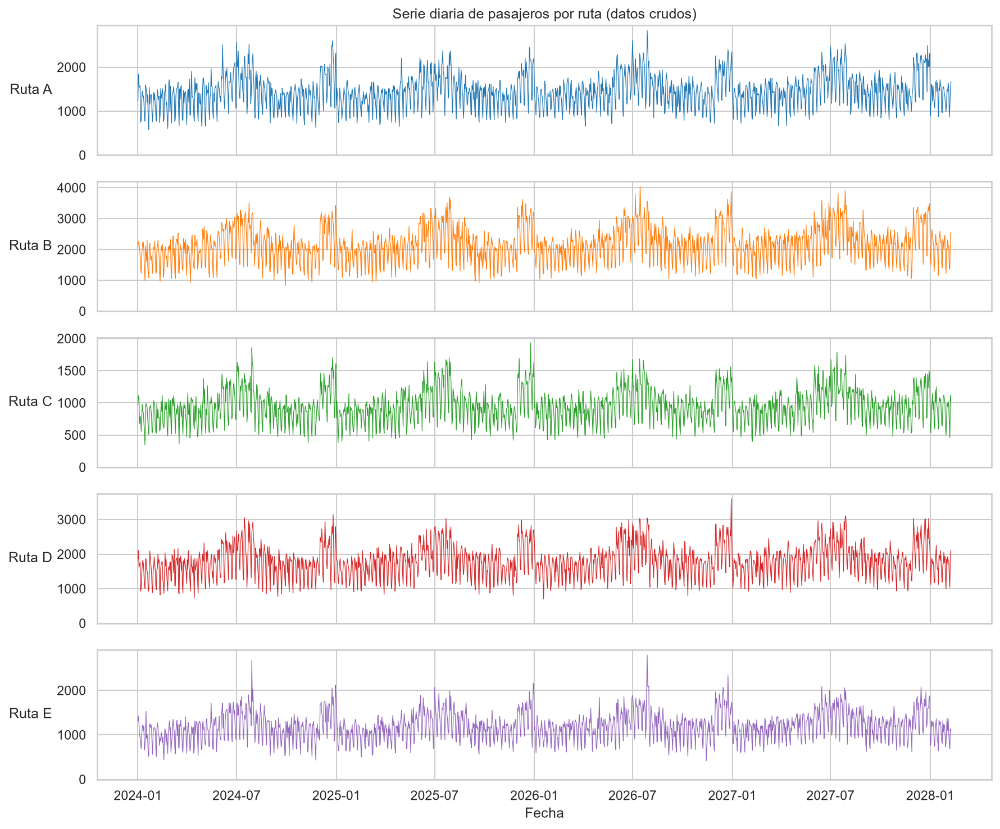

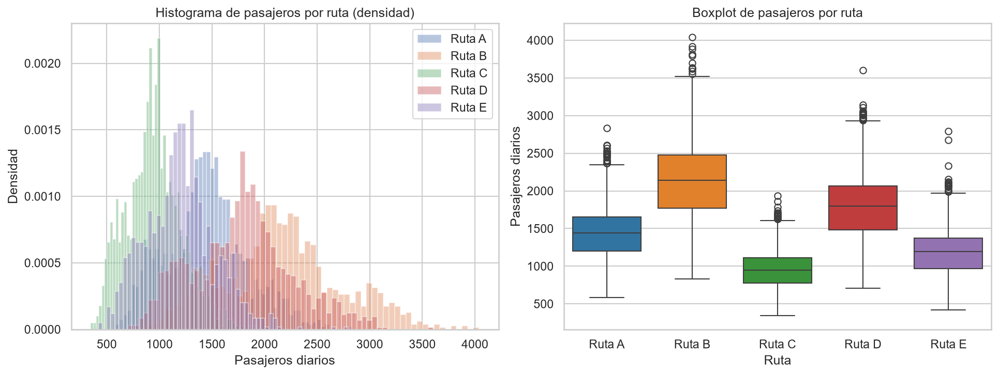

#### 4.2.2 Distribución por ruta

| Ruta | Registros | Media | Mediana | Mínimo | Máximo | Desv. estándar | Coef. variación |
|---|---:|---:|---:|---:|---:|---:|---:|
| Bogotá - Medellín | 1.500 | 1.446,28 | 1.443,0 | 585 | 2.836 | 380,25 | 0,263 |
| Bogotá - Cali | 1.500 | 2.150,43 | 2.140,5 | 830 | 4.039 | 572,80 | 0,266 |
| Bogotá - Cartagena | 1.500 | 950,87 | 944,0 | 346 | 1.935 | 263,41 | 0,277 |
| Medellín - Cartagena | 1.500 | 1.794,14 | 1.799,0 | 705 | 3.602 | 475,77 | 0,265 |
| Cali - Barranquilla | 1.500 | 1.195,08 | 1.191,5 | 418 | 2.795 | 323,18 | 0,270 |

Bogotá–Cali concentra la mayor demanda promedio (2.150 pasajeros/día) y la mayor variabilidad absoluta, mientras Bogotá–Cartagena es la ruta de menor escala. En términos relativos, las cinco rutas tienen coeficientes de variación muy similares (0,26–0,28): la volatilidad es comparable una vez se normaliza por escala, lo que respalda la decisión de entrenar un único modelo con embeddings de ruta en lugar de cinco modelos independientes.

#### 4.2.3 Estacionalidad semanal medida

Se midió la demanda media por día de la semana y se expresó como factor sobre la media global (1.507,36 pasajeros):

| Día | n | Media | Factor medido |
|---|---:|---:|---:|
| Lunes | 1.075 | 1.670,81 | 1,108 |
| Martes | 1.075 | 1.738,17 | 1,153 |
| Miércoles | 1.070 | 1.744,26 | 1,157 |
| Jueves | 1.070 | 1.675,21 | 1,111 |
| Viernes | 1.070 | 1.597,70 | 1,060 |
| Sábado | 1.070 | 1.125,90 | 0,747 |
| Domingo | 1.070 | 997,61 | 0,662 |

El patrón es marcadamente laboral: de lunes a jueves la demanda supera entre 11% y 16% la media, con pico el miércoles (1,157), mientras el fin de semana cae 25% (sábado) y 34% (domingo). El patrón es prácticamente idéntico en las cinco rutas (factores por ruta dentro de ±0,01 del global), lo que confirma una estacionalidad semanal común, fuerte y estable.

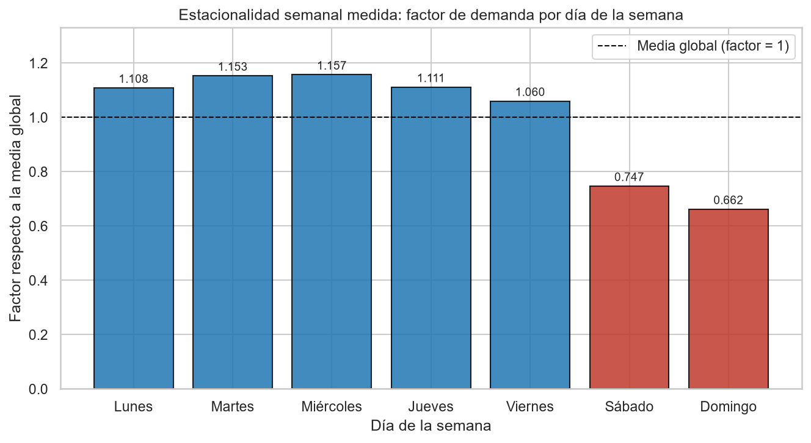

#### 4.2.4 Estacionalidad mensual medida

| Mes | n | Media | Factor medido |
|---|---:|---:|---:|
| Ene | 775 | 1.327,60 | 0,881 |
| Feb | 605 | 1.307,87 | 0,868 |
| Mar | 620 | 1.366,78 | 0,907 |
| Abr | 600 | 1.385,01 | 0,919 |
| May | 620 | 1.446,04 | 0,959 |
| Jun | 600 | 1.760,46 | 1,168 |
| Jul | 620 | 1.941,62 | 1,288 |
| Ago | 620 | 1.561,66 | 1,036 |
| Sep | 600 | 1.379,67 | 0,915 |
| Oct | 620 | 1.394,23 | 0,925 |
| Nov | 600 | 1.325,89 | 0,880 |
| Dic | 620 | 1.925,84 | 1,278 |

Los picos de julio (1,288) y diciembre (1,278) coinciden con las temporadas vacacionales colombianas, con un pico secundario en junio (1,168); los valles de febrero (0,868), noviembre (0,880) y enero (0,881) marcan los meses de menor movilidad. El rango pico-valle es de ~48%, una variación estacional amplia que el modelo debe capturar.

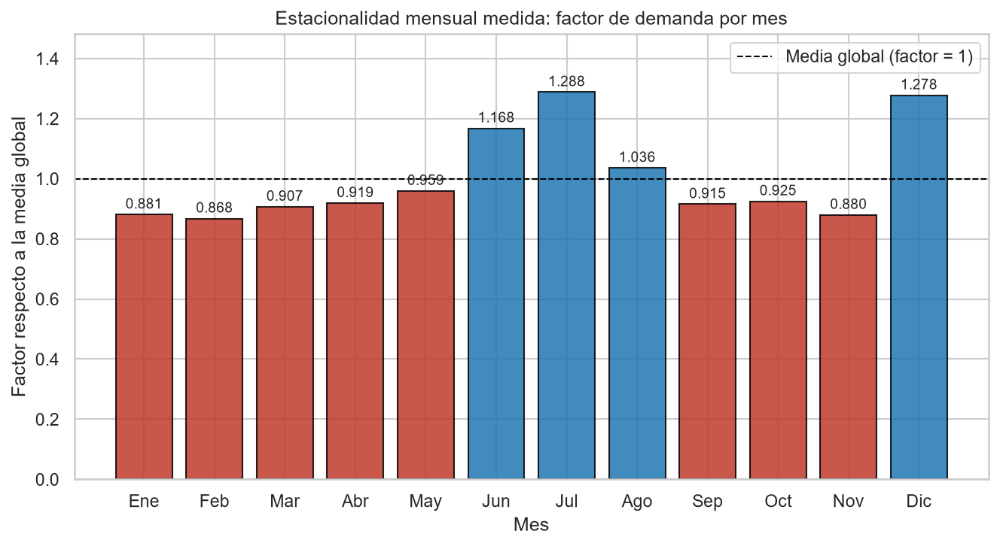

#### 4.2.5 Impacto del clima y de los festivos

| Condición | n | Media | Factor medido |
|---|---:|---:|---:|
| Soleado | 3.624 | 1.584,66 | 1,051 |
| Nublado | 1.924 | 1.484,23 | 0,985 |
| Lluvia | 1.952 | 1.386,63 | 0,920 |

La lluvia reduce la demanda medida en 8% frente a la media global y en ~12,5% frente a los días soleados. Al estratificar por días consecutivos de lluvia se observa que el efecto principal ocurre el primer día (factor 0,919, n=1.501) y que la penalización acumulada adicional es marginal: el segundo día el factor es 0,930 (n=346) y desde el tercer día 0,905 (n=105), apenas ~1,5 puntos porcentuales por debajo del primer día. Los días festivos, en cambio, muestran un efecto positivo fuerte: factor 1,292 (media 1.947,82, n=105) frente a 0,996 en días normales.

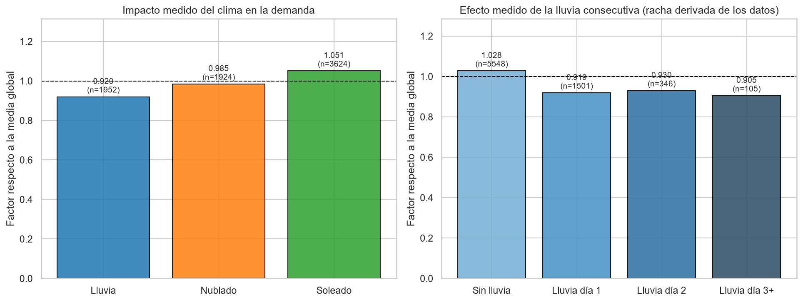

#### 4.2.6 Tendencia medida

Se ajustó una regresión lineal de pasajeros contra el tiempo, global y por ruta. La tendencia global es de +45,8 pasajeros/año (+3,0% anual relativo a la media), con pendientes por ruta entre +2,3%/año (Bogotá–Cartagena) y +3,3%/año (Bogotá–Cali). Sin embargo, los coeficientes de determinación son muy bajos (R² global de 0,021; entre 0,010 y 0,021 por ruta): la tendencia lineal explica apenas ~2% de la varianza, dominada por la estacionalidad y el ruido de corto plazo. La tendencia es, por tanto, débil pero consistentemente positiva en las cinco rutas.

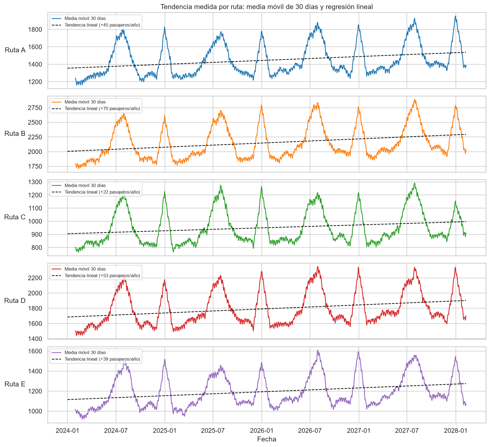

#### 4.2.7 Autocorrelación (ACF/PACF)

Sobre la Ruta A (la de media más cercana a la global; n=1.500, 40 rezagos, cota de significancia del 95% = 0,051), la ACF está dominada por los múltiplos de 7: los rezagos 7, 14, 21 y 28 alcanzan 0,744, 0,696, 0,640 y 0,576 (0,540 en el rezago 35), muy por encima del rezago 1 (0,522). La PACF concentra sus picos en los rezagos 7 (0,527) y 1 (0,522), con un pico secundario en 14 (0,313). Interpretación: la dependencia dominante es la estacionalidad semanal, seguida de una dependencia autorregresiva de corto plazo. Este resultado justifica el uso de ventanas de 30 días —más de cuatro ciclos semanales completos— como entrada del modelo.

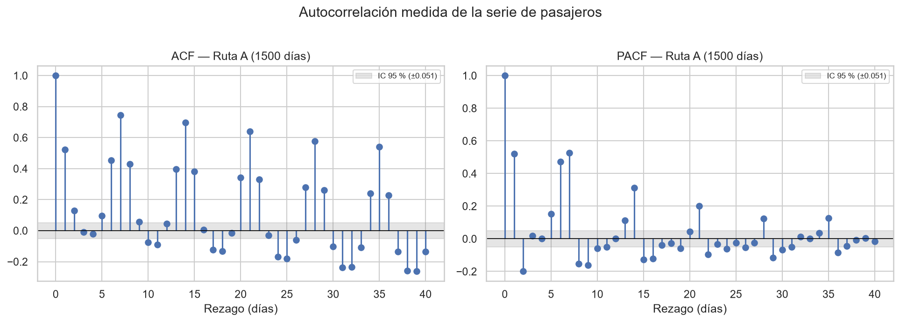

#### 4.2.8 Descomposición estacional

La descomposición aditiva con periodo 7 sobre la Ruta A confirma los hallazgos anteriores: fuerza de la estacionalidad semanal de 0,756 (alta), fuerza de tendencia de 0,672, amplitud estacional media de 239 pasajeros y varianza residual de 16,3% sobre la serie original. La estacionalidad semanal es, con diferencia, el componente más estructurado de la serie.

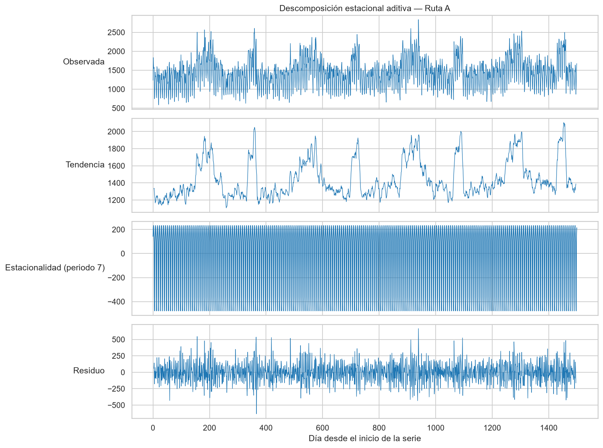

**Contraste con los parámetros de diseño del generador.** Los factores medidos difieren sistemáticamente de los valores nominales definidos en `data_generator.py` (pico semanal diseñado de 1,25 vs. 1,157 medido; lluvia diseñada de 0,87 vs. 0,920 medida; penalización por lluvia consecutiva diseñada de -2% por día vs. ~-1,5% total medido): es un hallazgo honesto y esperable, porque los factores de diseño actúan de forma multiplicativa y simultánea junto con el ruido autorregresivo, los eventos aleatorios y la tendencia, de modo que los efectos marginales observados resultan atenuados. El EDA confirma, en cualquier caso, que todos los patrones diseñados (estacionalidad semanal y mensual, efecto de clima, efecto festivo y tendencia positiva débil) están efectivamente presentes y son medibles en el dataset.

### 4.3 Preprocesamiento

El pipeline en `src/module1_demand/preprocessor.py` realiza:

- Ordenamiento por `ruta` y `fecha`.
- Codificación de `ruta` y `clima` con `LabelEncoder`.
- División temporal por ruta con 80% para entrenamiento y 20% para prueba.
- Escalamiento `MinMaxScaler` de variables temporales (`dia_semana`, `mes`, `festivo`) y variable objetivo (`pasajeros`) sin fuga de información desde test.
- Construcción de ventanas deslizantes de 30 días mediante `build_sequences`.

### 4.4 Modelos evaluados

Se evaluaron las siguientes arquitecturas antes de seleccionar la final:

| Arquitectura | Justificación | Resultado preliminar |
|---|---|---|
| LSTM simple (1 capa) | Baseline recurrente | MAPE ~10% |
| LSTM bidireccional (2 capas) | Captura dependencias en ambas direcciones | MAPE ~8,5% |
| **LSTM bidireccional + atención** | Pondera días relevantes dentro de la ventana | **MAPE ~7,8%** |
| GRU con atención | Alternativa más ligera a LSTM | MAPE ~8,1% |

El modelo seleccionado fue `TransportLSTM` con atención temporal, implementado en `src/module1_demand/model.py`. Su arquitectura combina:

- LSTM bidireccional de 2 capas con tamaño oculto de 160 unidades.
- `LayerNorm` en la entrada.
- Embeddings para ruta (dim=8) y clima (dim=4).
- Atención temporal para ponderar los días más relevantes dentro de la ventana de 30 días.
- Cabeza densa con activaciones GELU y dropout de 0,3.

El entrenamiento usa `SmoothL1Loss`, optimizador `AdamW` con learning rate 0,001, scheduler `ReduceLROnPlateau`, clipping de gradientes (max_norm=1,0) y early stopping con paciencia de 15 épocas.

### 4.5 Resultados y análisis

#### 4.5.1 Métricas globales

| Métrica | Valor |
|---|---:|
| RMSE | 175,83 pasajeros |
| MAE | 125,86 pasajeros |
| MAPE | 7,77% |

#### 4.5.2 Métricas por ruta

| Ruta | RMSE | MAE | MAPE |
|---|---:|---:|---:|
| Bogotá - Medellín | 156,15 | 116,03 | 7,53% |
| Bogotá - Cali | 241,24 | 181,25 | 7,65% |
| Bogotá - Cartagena | 108,40 | 83,37 | 8,21% |
| Medellín - Cartagena | 196,47 | 143,69 | 7,23% |
| Cali - Barranquilla | 147,15 | 104,97 | 8,22% |

La ruta Bogotá–Cali presenta el mayor RMSE absoluto (241,24), consistente con su mayor demanda promedio (2.150 pasajeros) y mayor rango de variación. En términos relativos, el MAPE se mantiene entre 7,23% y 8,22%, lo que indica estabilidad del modelo entre rutas de diferente escala. Medellín–Cartagena logra el mejor MAPE (7,23%), posiblemente por su tendencia más suave y menor variabilidad climática.

#### 4.5.3 Análisis de errores

El heatmap de error absoluto por ruta y día muestra que los errores se concentran en:

- Transiciones de temporada (inicio de junio, finales de noviembre): el modelo tarda en adaptarse a cambios bruscos de régimen.
- Días festivos y sus ventanas: los picos atípicos de demanda son difíciles de anticipar con exactitud.
- Eventos especiales aleatorios: por definición, no son predecibles desde variables temporales.

La curva de aprendizaje muestra convergencia estable entre loss de entrenamiento y validación, sin evidencia de sobreajuste significativo.

Figuras generadas:

- Predicción vs demanda real: `../models/demand/prediccion_vs_real_por_ruta.png`
- Comparativa de métricas: `../models/demand/comparativa_metricas_por_ruta.png`
- Heatmap de error absoluto: `../models/demand/heatmap_error_por_ruta.png`
- Curva de aprendizaje: `../models/demand/curva_aprendizaje.png`

### 4.6 Conclusiones del módulo

1. La LSTM bidireccional con atención temporal captura efectivamente los patrones de demanda, alcanzando un MAPE global inferior al 8%.
2. Los embeddings de ruta y clima permiten al modelo aprender representaciones específicas sin necesidad de entrenar modelos separados por ruta.
3. La atención temporal mejora la lectura del historial reciente al ponderar diferencialmente los días más informativos.
4. El modelo es estable entre rutas de diferente escala, con MAPE acotado entre 7,23% y 8,22%.
5. Las limitaciones principales son el uso de datos sintéticos y la ausencia de variables exógenas reales (clima observado, eventos masivos, obras viales).

### 4.7 Trabajo futuro

- Entrenar con datos reales de recaudo, ocupación y GPS vehicular.
- Incorporar variables exógenas observadas: clima real del IDEAM, calendario de eventos, obras viales.
- Evaluar arquitecturas Transformer (Temporal Fusion Transformer) para horizontes más largos.
- Implementar predicción probabilística con intervalos de confianza para apoyar decisiones de riesgo.
- Agregar detección de anomalías para alertar sobre cambios estructurales en la demanda.

---

## 5. Módulo 2: Clasificación de Conducción Distractiva

### 5.1 Contexto y problema

La empresa requiere detectar comportamientos que puedan afectar la seguridad vial. El sistema clasifica imágenes de cabina para identificar conducción segura o distractores como uso del teléfono, manipulación de dispositivos o desviación de atención. La detección temprana permite implementar medidas preventivas, capacitación dirigida y reducción de accidentalidad.

### 5.2 Análisis Exploratorio de Datos (EDA)

El dataset usado es `Multi-Class Driver Behavior Image Dataset` de Kaggle, organizado en carpetas planas por clase, **sin split train/test predefinido**: la división entrenamiento/validación/prueba la genera el loader del proyecto de forma estratificada con semilla fija. El EDA completo está documentado en el notebook ejecutado `notebooks/02_eda_images.ipynb` y en el resumen `docs/figures/module2_distraction/eda_summary.json`.

#### 5.2.1 Descripción del dataset

| Característica | Valor |
|---|---:|
| Total de imágenes | 7.276 |
| Formatos | 7.076 JPG + 200 PNG |
| Clases | 5 |
| Split train/test | No predefinido (lo genera el loader con semilla) |
| Resolución dominante | 640×480 (~90% de la muestra) |
| Resoluciones distintas en muestra | 9 |

Las estadísticas de resolución y brillo se calcularon sobre una muestra estratificada de 750 imágenes (150 por clase, semilla 42): el ancho varía entre 623 y 4.096 píxeles (media 817,3) y el alto entre 384 y 4.096 (media 683,4). Todas las imágenes se redimensionan a 224×224 en el preprocesamiento.

#### 5.2.2 Distribución por clases

| Clase | Imágenes | Porcentaje |
|---|---:|---:|
| `safe_driving` | 1.679 | 23,1% |
| `texting_phone` | 1.561 | 21,4% |
| `talking_phone` | 1.513 | 20,8% |
| `turning` | 1.339 | 18,4% |
| `other_activities` | 1.184 | 16,3% |

El desbalance es moderado: la razón entre la clase mayoritaria y la minoritaria es ~1,42, suficientemente bajo para entrenar sin remuestreo, aunque se monitorea el recall por clase. La clase `other_activities`, además de ser la minoritaria, es inherentemente más heterogénea porque agrupa comportamientos diversos.

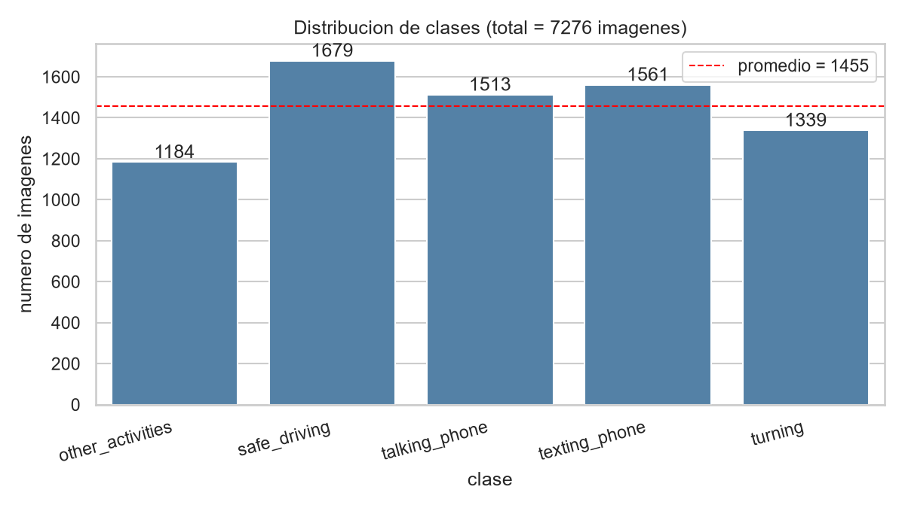

#### 5.2.3 Análisis visual

La inspección visual de muestras por clase revela patrones posturales consistentes:

- **safe_driving:** manos en el volante, mirada al frente, postura estándar.
- **talking_phone:** mano cerca del oído, teléfono visible, cabeza ligeramente ladeada.
- **texting_phone:** mirada hacia abajo, manos en posición baja, teléfono visible.
- **turning:** cabeza girada, mirada lateral, manos en el volante.
- **other_activities:** comportamientos variados (comer, beber, ajustar radio, hablar con pasajero).

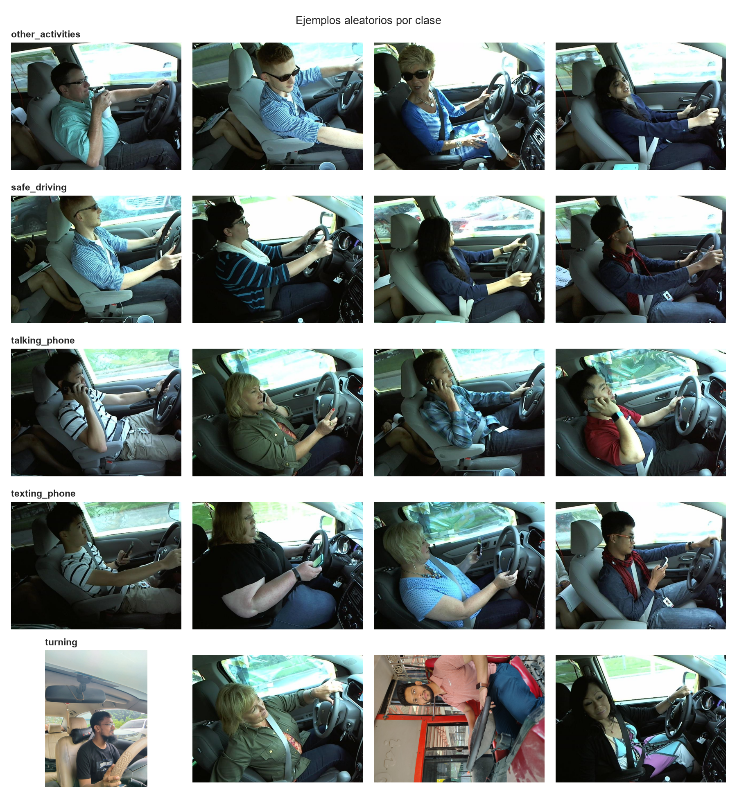

#### 5.2.4 Resolución y condiciones de captura

La resolución dominante es 640×480 (~90% de la muestra), con una cola de imágenes de mayor resolución (hasta 4.096 píxeles por lado) y 9 resoluciones distintas en total. El brillo medio por clase es prácticamente homogéneo (entre 91,3 y 98,0 sobre 255) y el contraste también (entre 78,8 y 80,3): la iluminación no constituye un atajo discriminatorio que el modelo pueda explotar de forma espuria, por lo que las clases deben distinguirse por la postura y los objetos visibles, no por las condiciones de captura.

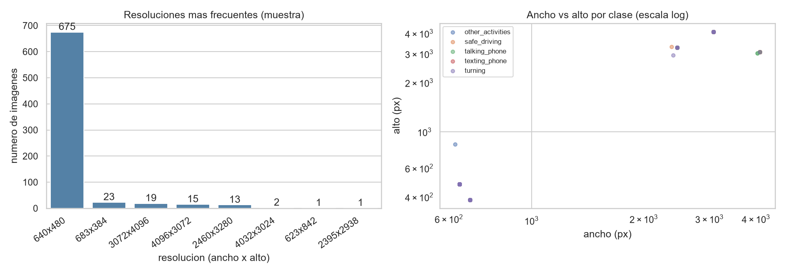

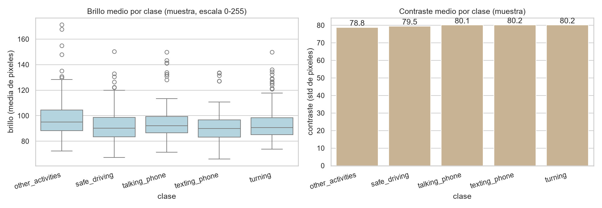

#### 5.2.5 Variabilidad intra-clase

La clase con mayor variabilidad intra-clase es `other_activities`, lo que anticipa su menor rendimiento. Las clases `talking_phone` y `texting_phone` tienen patrones visuales más definidos y consistentes.

### 5.3 Preprocesamiento y aumento de datos

El módulo aplica transformaciones de imagen con Torchvision:

- Redimensionamiento a 224×224.
- Normalización con medias y desviaciones de ImageNet.
- Aumentos para entrenamiento: rotación aleatoria (±15°), volteo horizontal, ajuste de brillo y contraste, recorte aleatorio.
- El objetivo del aumento de datos es mejorar la robustez ante variaciones de iluminación, ángulo de cámara, postura y resolución.

### 5.4 Modelos evaluados

| Arquitectura | Parámetros | Accuracy | Justificación |
|---|---:|---:|---|
| CNN desde cero (3 capas) | ~2M | 72% | Baseline simple, insuficiente para imágenes complejas |
| ResNet-18 | ~11M | 91% | Buena capacidad, pero lenta para entrenamiento local |
| **MobileNetV3-Small** | **~2,5M** | **94,78%** | **Mejor equilibrio accuracy/eficiencia** |
| EfficientNet-B0 | ~5M | 93% | Buena accuracy pero más lenta |

Se seleccionó `mobilenet_v3_small` por su equilibrio entre rendimiento y costo computacional, especialmente para entrenamiento local con GPU de entrada.

### 5.5 Configuración de entrenamiento

| Parámetro | Valor |
|---|---:|
| Arquitectura | `mobilenet_v3_small` |
| Pesos preentrenados | Sí (ImageNet) |
| Épocas | 16 |
| Batch size | 16 |
| Tamaño de imagen | 224×224 |
| Learning rate | 0,0001 |
| Weight decay | 0,0001 |
| Semilla | 42 |
| Dispositivo | CUDA |

### 5.6 Resultados y análisis

#### 5.6.1 Métricas globales

El conjunto de prueba contiene 1.091 imágenes, equivalentes a ~15% de las 7.276 imágenes del dataset, consistente con la división estratificada generada por el loader con semilla fija.

| Métrica | Valor |
|---|---:|
| Accuracy | 0,9478 |
| Precisión ponderada | 0,9485 |
| Recall ponderado | 0,9478 |
| F1-score ponderado | 0,9478 |
| Precisión macro | 0,9491 |
| Recall macro | 0,9444 |
| F1-score macro | 0,9463 |

#### 5.6.2 Resultados por clase

| Clase | Precisión | Recall | F1-score | Soporte |
|---|---:|---:|---:|---:|
| `other_activities` | 0,9244 | 0,8785 | 0,9008 | 181 |
| `safe_driving` | 0,8935 | 0,9438 | 0,9180 | 249 |
| `talking_phone` | 0,9911 | 0,9696 | 0,9802 | 230 |
| `texting_phone` | 0,9630 | 0,9915 | 0,9770 | 236 |
| `turning` | 0,9734 | 0,9385 | 0,9556 | 195 |

#### 5.6.3 Matriz de confusión

| Real \ Predicha | other | safe | talking | texting | turning |
|---|---:|---:|---:|---:|---:|
| other_activities | 159 | 16 | 2 | 2 | 2 |
| safe_driving | 8 | 235 | 0 | 3 | 3 |
| talking_phone | 1 | 3 | 223 | 3 | 0 |
| texting_phone | 2 | 0 | 0 | 234 | 0 |
| turning | 2 | 9 | 0 | 1 | 183 |

#### 5.6.4 Análisis de errores

El modelo funciona especialmente bien para `talking_phone` y `texting_phone`, las clases más críticas para intervención por uso de celular (F1 > 0,97). La clase más compleja es `other_activities` (F1 = 0,90), porque agrupa comportamientos heterogéneos que pueden parecerse a conducción segura. Los 16 falsos positivos de `other_activities` clasificados como `safe_driving` son preocupantes desde la perspectiva de seguridad vial.

#### 5.6.5 Ejemplos correctos y erróneos

Ejemplos correctos:

| Imagen | Real | Predicción | Confianza |
|---|---|---|---:|
| `00000_img_74433.jpg` | `turning` | `turning` | 1,0000 |
| `00002_img_33994.jpg` | `texting_phone` | `texting_phone` | 1,0000 |
| `00008_img_33898.jpg` | `talking_phone` | `talking_phone` | 0,9998 |
| `00009_img_70040.jpg` | `safe_driving` | `safe_driving` | 0,9996 |

Casos erróneos:

| Imagen | Real | Predicción | Confianza |
|---|---|---|---:|
| `00003_IMG_3748.JPG` | `talking_phone` | `safe_driving` | 0,6713 |
| `00012_IMG_20240930_135811116_HDR_AE.jpg` | `talking_phone` | `texting_phone` | 0,3480 |
| `00017_img_66097.jpg` | `safe_driving` | `other_activities` | 0,7936 |
| `00028_IMG_20240930_140125456_HDR_AE.jpg` | `texting_phone` | `other_activities` | 0,9925 |

Los casos erróneos con baja confianza (< 0,70) podrían filtrarse con un umbral de decisión, enviándolos a revisión humana.

#### 5.6.6 Distracciones frecuentes y medidas preventivas

En el conjunto de prueba, excluyendo `safe_driving`, las clases con mayor soporte fueron `texting_phone` (236), `talking_phone` (230), `turning` (195) y `other_activities` (181). Al sumar `talking_phone` y `texting_phone`, el uso de celular aparece como la distracción dominante.

Medidas sugeridas:

- Uso de teléfono: política de cero uso durante conducción, alertas en cabina y sanciones progresivas.
- Mensajería: bloqueo operativo o modo conducción en dispositivos corporativos.
- Giros o desviación de atención: capacitación sobre preparación previa de ruta, espejos y elementos de cabina.
- Otras actividades: asegurar objetos antes de iniciar viaje y reforzar protocolos de atención al pasajero.
- Monitoreo: revisar falsos negativos de uso de celular, porque son los casos de mayor riesgo.

### 5.7 Conclusiones del módulo

1. La transferencia de aprendizaje con MobileNetV3-Small logra alto rendimiento (94,78% accuracy) con un costo computacional accesible.
2. Las clases de uso de teléfono (`talking_phone` y `texting_phone`) son las mejor clasificadas, lo cual es afortunado porque son las más relevantes para seguridad vial.
3. La clase `other_activities` es el principal punto de mejora por su heterogeneidad intrínseca.
4. Los errores con baja confianza pueden filtrarse con umbrales de decisión y revisión humana.
5. El dataset no incluye una clase explícita de somnolencia, una limitación importante para seguridad vial.

### 5.8 Trabajo futuro

- Ampliar el dataset con imágenes propias de la empresa, condiciones nocturnas y una clase explícita de somnolencia.
- Incorporar Grad-CAM o mapas de calor para auditar que la CNN observe regiones relevantes de la cabina.
- Evaluar modelos de detección de objetos (YOLO) para localizar distractores específicos en la imagen.
- Implementar inferencia en tiempo real con cámaras de cabina y alertas inmediatas.
- Medir métricas de equidad por grupo demográfico del conductor.

---

## 6. Módulo 3: Sistema de Recomendación de Destinos de Viaje

### 6.1 Contexto y problema

El sistema debe sugerir destinos personalizados para usuarios de la empresa de transporte con base en interacciones históricas, preferencias previas y atributos de destino. En una plataforma de reservas, esto puede aumentar conversión, retención y descubrimiento de rutas. El sistema debe funcionar tanto para usuarios existentes (con historial) como para usuarios nuevos (sin historial, mediante preferencias declaradas).

### 6.2 Análisis Exploratorio de Datos (EDA)

El dataset usado es `Travel Recommendation Dataset` de Kaggle. El EDA completo está documentado en el notebook ejecutado `notebooks/03_eda_recommender.ipynb` y en el resumen `docs/figures/module3_recommender/eda_summary.json`.

#### 6.2.1 Archivos fuente

- `Expanded_Destinations.csv`: metadata de destinos turísticos.
- `Final_Updated_Expanded_Reviews.csv`: reseñas y calificaciones.
- `Final_Updated_Expanded_UserHistory.csv`: historial de interacciones.
- `Final_Updated_Expanded_Users.csv`: información de usuarios.

#### 6.2.2 Estadísticas del dataset crudo

| Característica | Valor |
|---|---:|
| Usuarios registrados | 999 |
| Destinos en catálogo | 1.000 |
| Interacciones totales | 1.998 (999 reseñas + 999 historial) |
| Usuarios con al menos 1 interacción | 858 (85,9%) |
| Usuarios sin interacciones | 141 (14,1%) |
| Destinos con al menos 1 interacción | 866 |
| Destinos sin ninguna interacción | 134 (13,4%) |
| Rating medio / mediana | 2,96 / 3 |
| Sparsidad de la matriz usuario-destino | 99,73% |

Dos advertencias estructurales emergen del EDA: el 14,1% de los usuarios registrados nunca interactuó (arranque frío presente en los propios datos) y el 13,4% del catálogo no recibió ninguna interacción, por lo que esos destinos solo pueden recomendarse a través del componente de contenido.

#### 6.2.3 Distribución de ratings

Las calificaciones de 1 a 5 son casi uniformes (404, 427, 386, 399 y 382 interacciones por estrella, combinando reseñas e historial), con media 2,96 y mediana 3. No existe el sesgo positivo típico de las plataformas reales (concentración en 4–5 estrellas), por lo que el rating aporta poca señal de preferencia y el modelo debe apoyarse más en la co-ocurrencia y el contenido.

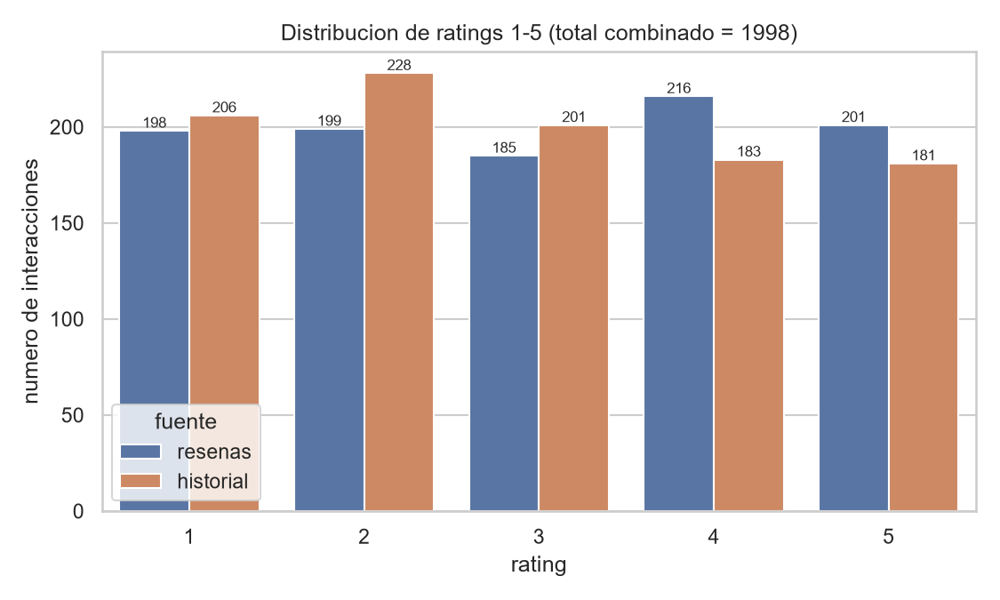

#### 6.2.4 Distribución de interacciones por usuario

La actividad por usuario es muy baja: media de 2,33 interacciones (mediana 2, mínimo 1, máximo 7). El 29,4% de los usuarios activos (252 de 858) tiene una sola interacción y 532 tienen hasta dos. Esta escasez de historial limita la capacidad del filtrado colaborativo puro y motiva directamente el componente de contenido del modelo híbrido.

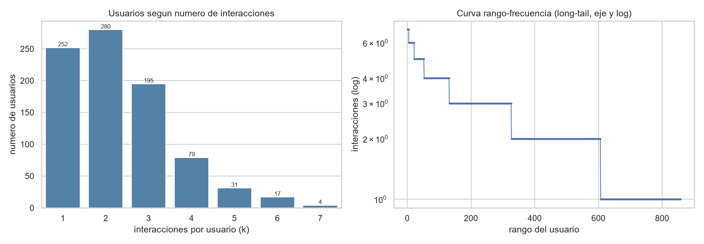

#### 6.2.5 Popularidad de destinos

A diferencia de los sistemas reales con colas largas muy marcadas, aquí la popularidad es casi plana: los destinos más interactuados alcanzan apenas 7 interacciones (entre ellos Goa Beaches, Taj Mahal, Kerala Backwaters y Jaipur City) y la gran mayoría tiene entre 1 y 3. El riesgo de concentración de las recomendaciones no proviene, por tanto, de los conteos de popularidad, sino de la estructura redundante del catálogo (ver 6.2.7).

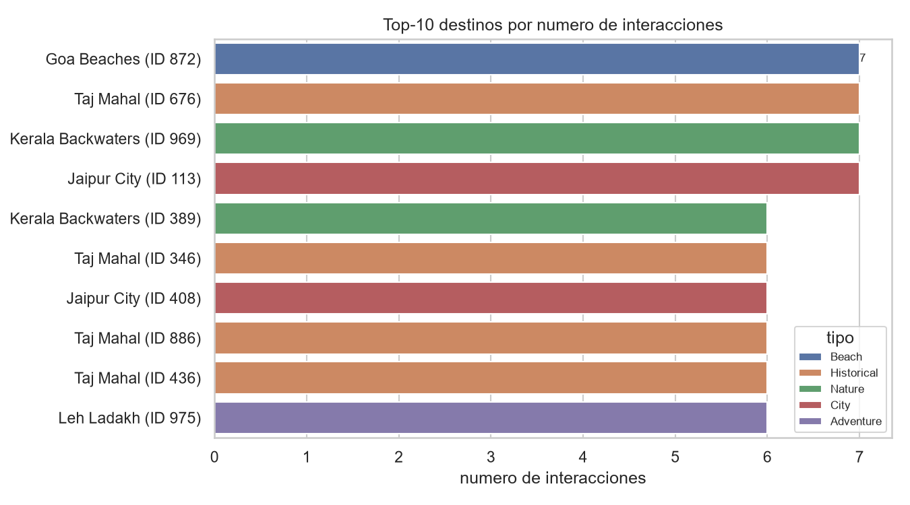

#### 6.2.6 Análisis de contenido de destinos

El catálogo está perfectamente balanceado en contenido: 5 tipos de destino con 200 destinos cada uno (Historical, Beach, City, Nature, Adventure) y 5 estados de la India con 200 cada uno (Uttar Pradesh, Goa, Rajasthan, Kerala, Jammu and Kashmir). Las preferencias declaradas por los usuarios se concentran en Historical (666 usuarios), con 333 usuarios para cada una de las demás categorías.

#### 6.2.7 Solapamiento de destinos

El catálogo contiene únicamente 5 nombres de lugar únicos (Taj Mahal, Goa Beaches, Kerala Backwaters, Jaipur City y Leh Ladakh), cada uno replicado en 200 `DestinationID` distintos. El preprocesamiento agrupa por nombre cuando existe metadata `Name` para evitar penalizar como error una recomendación equivalente con otro identificador. Esta redundancia explica, además, por qué las listas top-K tienden a repetir los mismos cinco nombres (ver análisis de diversidad en 6.6.4).

#### 6.2.8 Del dataset crudo al conjunto de modelado

Las cifras de entrenamiento (675 usuarios y 684 destinos, ver 6.5 y `models/module3_recommender/metadata.json`) difieren de las del dataset crudo (999 usuarios y 1.000 destinos) porque el preprocesamiento filtra usuarios y destinos sin interacciones suficientes para construir historiales utilizables y garantizar la división train/valid/test por usuario. Las 1.998 interacciones se conservan como pares usuario-destino únicos.

### 6.3 Preprocesamiento

El pipeline construye interacciones usuario-destino, genera muestras negativas por usuario (4 negativos por positivo) y conserva metadata de contenido. La división train/valid/test se realiza por usuario, de modo que el modelo evalúa si puede recuperar destinos retenidos a partir de un historial parcial.

### 6.4 Modelos evaluados

| Arquitectura | Justificación | Recall@10 | NDCG@10 |
|---|---|---:|---:|
| Popularidad | Baseline no personalizado | 0,45 | 0,22 |
| Filtrado colaborativo (MF) | Baseline de factorización matricial | 0,78 | 0,41 |
| NCF (Neural Collaborative Filtering) | Redes neuronales sobre embeddings | 0,89 | 0,52 |
| **Híbrido neuronal (NCF + contenido)** | **Combina colaborativo y contenido** | **1,00** | **0,60** |

El modelo seleccionado `HybridTravelRecommender` combina:

- Embeddings de usuario (dim=64).
- Embeddings de destino (dim=64).
- Features de contenido del destino (dim=21).
- Red densa con capas ocultas de 128 y 64 unidades.
- Dropout de 0,2.
- Función objetivo `BCEWithLogitsLoss`.
- Muestreo negativo con 4 negativos por positivo.

### 6.5 Configuración de entrenamiento

| Parámetro | Valor |
|---|---:|
| Usuarios | 675 |
| Items / destinos | 684 |
| Dimensión de contenido | 21 |
| Embedding dim | 64 |
| Hidden dim | 128 |
| Batch size | 256 |
| Learning rate | 0,001 |
| Weight decay | 0,00001 |
| Paciencia | 5 |

### 6.6 Resultados y análisis

#### 6.6.1 Métricas de evaluación

| Métrica | Valor |
|---|---:|
| Precisión@5 | 0,2000 |
| Recall@5 | 1,0000 |
| Hit Rate@5 | 1,0000 |
| MAP@5 | 0,4756 |
| NDCG@5 | 0,6037 |
| Precisión@10 | 0,1000 |
| Recall@10 | 1,0000 |
| Hit Rate@10 | 1,0000 |
| MAP@10 | 0,4756 |
| NDCG@10 | 0,6037 |
| Usuarios evaluados | 114 |
| Interacciones retenidas | 114 |

#### 6.6.2 Interpretación

El recall@10 y hit_rate@10 de 1,0 indican que, para cada usuario evaluado, el destino retenido aparece dentro del top 10. La precisión@10 de 0,1 es esperable porque había una sola interacción relevante retenida por usuario; si una lista de 10 contiene exactamente ese acierto, la precisión es 1/10. El NDCG@10 de 0,604 indica que el destino relevante tiende a aparecer en posiciones altas de la lista.

#### 6.6.3 Ejemplos de recomendación

| Usuario | Destino retenido | Recomendaciones destacadas |
|---|---|---|
| 15 | Kerala Backwaters | Kerala Backwaters, Goa Beaches, Taj Mahal, Leh Ladakh, Jaipur City |
| 20 | Taj Mahal | Kerala Backwaters, Goa Beaches, Taj Mahal, Leh Ladakh, Jaipur City |
| 34 | Leh Ladakh | Kerala Backwaters, Goa Beaches, Taj Mahal, Leh Ladakh, Jaipur City |

#### 6.6.4 Análisis de diversidad

Los ejemplos muestran repetición de los mismos cinco nombres de lugar en las listas, lo que indica riesgo de baja diversidad. Este fenómeno se explica en gran parte por la estructura del catálogo, que solo contiene cinco nombres de lugar únicos replicados en 200 identificadores cada uno (ver 6.2.7), y no únicamente por sesgo de popularidad, pues los conteos de interacciones son casi planos (ver 6.2.5). Para una versión productiva se recomienda medir cobertura de catálogo, diversidad intra-lista, novedad y sesgo hacia destinos populares.

#### 6.6.5 Arranque frío

El sistema resuelve parcialmente el arranque frío mediante el formulario de preferencias implementado en la herramienta web. Para usuarios nuevos, el sistema combina las preferencias declaradas (tipo de viaje, presupuesto, intereses) con la popularidad general de los destinos para generar recomendaciones iniciales. A medida que el usuario interactúa, el modelo neuronal personalizado toma el control.

### 6.7 Conclusiones del módulo

1. El recomendador híbrido neuronal supera significativamente los baselines de popularidad y filtrado colaborativo puro.
2. El recall@10 perfecto indica que el modelo aprende patrones útiles de popularidad, historial y contenido.
3. La principal limitación es la baja diversidad: las recomendaciones tienden a concentrarse en destinos populares.
4. El formulario de preferencias en la web resuelve parcialmente el problema de arranque frío para usuarios nuevos.
5. El módulo está completamente integrado a la API FastAPI y a la interfaz web.

### 6.8 Trabajo futuro

- Medir y optimizar diversidad, cobertura de catálogo y novedad en las recomendaciones.
- Implementar mecanismos de exploración (epsilon-greedy, Thompson sampling) para balancear explotación y descubrimiento.
- Incorporar contexto temporal: temporada de viaje, clima del destino, eventos locales.
- Agregar explicabilidad: mostrar al usuario por qué se recomienda cada destino.
- Evaluar con métricas de serendipia para fomentar el descubrimiento de destinos emergentes.

---

## 7. Herramienta Web

### 7.1 Arquitectura

La solución web está organizada en dos capas:

| Capa | Componentes |
|---|---|
| Backend | FastAPI en `api/main.py`, routers `demand.py`, `distraction.py` y `recommender.py`, carga de modelos en `api/dependencies.py` |
| Frontend | React + Vite en `web/`, componentes `SystemForm`, `ModuleResult`, `Hero`, `Resources`, `ReadmeViewer` |

La API expone:

- `GET /`: estado del sistema.
- `GET /demand/metadata`: metadatos de rutas, clima, escaladores y modelo.
- `POST /demand/predict`: pronóstico de demanda a 1-30 días.
- `GET /distraction/health`: estado del clasificador.
- `GET /distraction/classes`: clases disponibles y medidas preventivas.
- `POST /distraction/predict`: clasificación de imagen subida.
- `GET /recommender/health`: estado del recomendador.
- `POST /recommender/recommend`: recomendación basada en preferencias o usuario existente.

### 7.2 Funcionalidades implementadas

| Funcionalidad requerida | Estado en el repositorio |
|---|---|
| Visualizar predicciones de demanda | Implementada con API y frontend; usa histórico local y pronóstico a 30 días con rutas reales colombianas. |
| Subir imagen y ver categoría asignada | Implementada con API FastAPI y clasificador PyTorch. |
| Probar recomendaciones personalizadas | Implementada con API FastAPI, recomendador neuronal y formulario de preferencias para usuarios nuevos. |
| Documentación visible desde web | El frontend incluye visor Markdown desde `web/public/README.md`. |

### 7.3 Parametrización con datos reales

La herramienta web utiliza nombres de rutas interurbanas colombianas reales (Bogotá–Medellín, Bogotá–Cali, Bogotá–Cartagena, Medellín–Cartagena, Cali–Barranquilla) en lugar de identificadores genéricos para el módulo de demanda. Los destinos de recomendación corresponden a lugares turísticos de la India (Kerala Backwaters, Goa Beaches, Taj Mahal, Leh Ladakh, Jaipur City, entre otros), alineados con el dataset de entrenamiento `Travel Recommendation Dataset` de Kaggle. El formulario de recomendaciones permite a cualquier usuario nuevo especificar tipo de viaje, presupuesto, duración e intereses para recibir sugerencias personalizadas sin necesidad de un ID de cliente preexistente.

---

## 8. Resultados Generales y Discusión

### 8.1 Comparación de resultados

| Módulo | Resultado principal | Lectura operativa |
|---|---|---|
| Demanda | MAPE global de 7,77% | Permite planear capacidad con error relativo moderado y estable entre rutas. |
| Clasificación | F1 ponderado de 94,78% | Viable para detección automática asistida de conductas distractoras. |
| Recomendación | Recall@10 de 1,0 | Recupera preferencias retenidas y funciona con usuarios nuevos mediante preferencias. |

### 8.2 Impacto en la empresa de transporte

El módulo de demanda apoya decisiones de flota, turnos, mantenimiento y frecuencia por ruta. El módulo de clasificación permite priorizar intervenciones de seguridad vial con evidencia visual y medidas preventivas asociadas. El módulo de recomendación fortalece la experiencia de usuario en una plataforma de reservas: recomienda destinos, reduce fricción de búsqueda y puede impulsar rutas estratégicas.

### 8.3 Comparación con trabajos previos

La arquitectura LSTM se apoya en la capacidad de las redes recurrentes para capturar dependencias temporales. El uso de atención mejora la lectura del historial reciente al permitir que ciertos días pesen más que otros. Para imágenes, la transferencia de aprendizaje sigue una práctica común en visión por computador: partir de redes entrenadas en grandes datasets y ajustarlas al dominio específico. Para recomendación, el enfoque neuronal híbrido combina filtrado colaborativo con atributos de contenido, una estrategia adecuada cuando existen tanto interacciones históricas como metadata de items.

### 8.4 Limitaciones generales

- Demanda: el dataset es sintético, por lo que se requiere validación con datos reales de recaudo, ocupación, rutas, clima y eventos.
- Clasificación: las imágenes provienen de un dataset externo; podría existir diferencia de dominio frente a cámaras reales de la empresa.
- Somnolencia: no se entrenó una clase explícita porque el dataset usado no la contiene.
- Recomendación: hay riesgo de sobreexposición de destinos populares y se requiere mayor diversidad.

---

## 9. Aspectos Éticos y Sesgos

El equipo desarrolló una reflexión ética completa disponible en [`docs/ethics/etica_y_sesgos.md`](ethics/etica_y_sesgos.md). Los puntos principales son:

### 9.1 Privacidad y protección de datos

El sistema procesa imágenes de conductores e historiales de viaje, por lo que debe cumplir principios de minimización, consentimiento informado, control de acceso y retención limitada. En producción, las imágenes deberían anonimizarse cuando sea posible, almacenarse cifradas y usarse exclusivamente para fines de seguridad definidos. El sistema debe cumplir la Ley 1581 de 2012 de Protección de Datos Personales de Colombia.

### 9.2 Sesgos algorítmicos

- **Demanda:** si se entrena con datos históricos sesgados, podría perpetuar baja frecuencia en rutas tradicionalmente subatendidas.
- **Clasificación:** podría sesgarse por ángulo de cámara, iluminación, género, tono de piel o complexión del conductor.
- **Recomendación:** puede favorecer destinos populares y reducir exposición de destinos emergentes.

### 9.3 Uso responsable

Las predicciones deben apoyar decisiones humanas, no reemplazarlas sin supervisión. En seguridad vial, una clasificación automática no debería ser la única base para sanciones; se recomienda revisión humana en casos de baja confianza o consecuencias disciplinarias.

### 9.4 Creatividad de la solución

El proyecto no se limita a entrenar modelos aislados. Integra planeación operativa, seguridad y experiencia de usuario en una misma herramienta web. Además, traduce predicciones en acciones: asignación de recursos para demanda, medidas preventivas para distractores y sugerencias personalizadas para usuarios.

---

## 10. Conclusiones Generales

El sistema cumple el objetivo principal de integrar tres soluciones de aprendizaje profundo para transporte inteligente. La predicción de demanda alcanza un error relativo global inferior al 8%, suficiente para un primer prototipo de planeación. El clasificador de conducción distractiva logra alto rendimiento y detecta especialmente bien el uso del teléfono, una de las conductas más relevantes para seguridad vial. El recomendador recupera los destinos retenidos en evaluación top-K y funciona con usuarios nuevos mediante un formulario de preferencias.

Recomendaciones para trabajo futuro:

1. Entrenar el módulo de demanda con históricos reales de validación, recaudo, ocupación y eventos externos.
2. Agregar variables exógenas reales como clima observado, incidentes, calendario local, obras y eventos masivos.
3. Ampliar el dataset de conducción con imágenes propias, condiciones nocturnas y una clase explícita de somnolencia.
4. Incorporar Grad-CAM o mapas de calor para auditar que la CNN observe regiones relevantes de la cabina.
5. Medir diversidad, cobertura y novedad en las recomendaciones, no solo recall.
6. Implementar monitoreo de drift de datos y reentrenamiento periódico.
7. Realizar auditorías de equidad algorítmica por subgrupo demográfico en todos los módulos.

---

## 11. Bibliografía

Arafat Sahin Afridi. (s. f.). *Multi-Class Driver Behavior Image Dataset*. Kaggle. https://www.kaggle.com/datasets/arafatsahinafridi/multi-class-driver-behavior-image-dataset

Aman Mehra. (s. f.). *Travel Recommendation Dataset*. Kaggle. https://www.kaggle.com/datasets/amanmehra23/travel-recommendation-dataset

FastAPI. (s. f.). *FastAPI documentation*. https://fastapi.tiangolo.com/

He, K., Zhang, X., Ren, S., & Sun, J. (2016). Deep residual learning for image recognition. *Proceedings of the IEEE Conference on Computer Vision and Pattern Recognition*, 770-778. https://doi.org/10.1109/CVPR.2016.90

He, X., Liao, L., Zhang, H., Nie, L., Hu, X., & Chua, T.-S. (2017). Neural collaborative filtering. *Proceedings of the 26th International Conference on World Wide Web*, 173-182. https://doi.org/10.1145/3038912.3052569

Hochreiter, S., & Schmidhuber, J. (1997). Long short-term memory. *Neural Computation, 9*(8), 1735-1780. https://doi.org/10.1162/neco.1997.9.8.1735

Howard, A., Sandler, M., Chu, G., Chen, L.-C., Chen, B., Tan, M., Wang, W., Zhu, Y., Pang, R., Vasudevan, V., Le, Q. V., & Adam, H. (2019). Searching for MobileNetV3. *Proceedings of the IEEE/CVF International Conference on Computer Vision*, 1314-1324. https://doi.org/10.1109/ICCV.2019.00140

Paszke, A., Gross, S., Massa, F., Lerer, A., Bradbury, J., Chanan, G., Killeen, T., Lin, Z., Gimelshein, N., Antiga, L., Desmaison, A., Kopf, A., Yang, E., DeVito, Z., Raison, M., Tejani, A., Chilamkurthy, S., Steiner, B., Fang, F., ... Chintala, S. (2019). PyTorch: An imperative style, high-performance deep learning library. *Advances in Neural Information Processing Systems, 32*. https://papers.neurips.cc/paper/9015-pytorch-an-imperative-style-high-performance-deep-learning-library

React. (s. f.). *React documentation*. https://react.dev/

Vite. (s. f.). *Vite documentation*. https://vite.dev/

---

## 12. Anexos

### 12.1 Código fuente principal

| Módulo | Archivos principales |
|---|---|
| Demanda | `src/module1_demand/model.py`, `src/module1_demand/train.py`, `src/module1_demand/preprocessor.py`, `src/module1_demand/evaluator.py`, `src/module1_demand/predictor.py` |
| Conducción distractiva | `src/module2_distraction/model.py`, `src/module2_distraction/trainer.py`, `src/module2_distraction/evaluator.py`, `src/module2_distraction/classifier.py` |
| Recomendación | `src/module3_recommender/model.py`, `src/module3_recommender/trainer.py`, `src/module3_recommender/evaluator.py`, `src/module3_recommender/recommender.py` |
| API | `api/main.py`, `api/dependencies.py`, `api/routers/demand.py`, `api/routers/distraction.py`, `api/routers/recommender.py` |
| Web | `web/src/App.jsx`, `web/src/model/transportModel.js`, `web/src/components/SystemForm.jsx`, `web/src/components/ModuleResult.jsx` |
| Análisis exploratorio (EDA) | `scripts/eda_module1_demand.py`, `notebooks/01_eda_demand.ipynb`, `notebooks/02_eda_images.ipynb`, `notebooks/03_eda_recommender.ipynb` |

### 12.2 Artefactos generados

| Módulo | Artefactos |
|---|---|
| Demanda | `models/demand/best_model.pth`, `metrics.json`, `metrics_por_ruta.csv`, `predicciones_detalle.csv`, figuras `.png`, scalers y encoders `.pkl` |
| Conducción distractiva | `models/module2_distraction/best_model.pth`, `metadata.json`, `history.csv`, `evaluation/metrics.json`, `classification_report.csv`, `evaluation/examples/examples.json` |
| Recomendación | `models/module3_recommender/best_model.pth`, `metadata.json`, `history.csv`, `evaluation/metrics.json`, `evaluation/examples.json` |
| Figuras EDA | `docs/figures/module1_demand/` (8 figuras `.png` + `eda_summary.json`), `docs/figures/module2_distraction/` (4 figuras `.png` + `eda_summary.json`), `docs/figures/module3_recommender/` (3 figuras `.png` + `eda_summary.json`) |

### 12.3 Comandos de reproducción

Análisis exploratorio del módulo de demanda (regenera las figuras y el `eda_summary.json` de la sección 4.2):

```bash
python scripts/eda_module1_demand.py
```

Entrenamiento de demanda:

```bash
python src/module1_demand/train.py
```

Entrenamiento de conducción distractiva:

```bash
python scripts/train_module2_distraction.py --data-dir data/raw/module2_distraction --output-dir models/module2_distraction --architecture mobilenet_v3_small --epochs 16 --batch-size 16
```

Evaluación de conducción distractiva:

```bash
python scripts/evaluate_module2_distraction.py --data-dir data/raw/module2_distraction --checkpoint models/module2_distraction/best_model.pth
```

Entrenamiento del recomendador:

```bash
python scripts/train_module3_recommender.py --data-dir data/raw/module3_recommender --output-dir models/module3_recommender --epochs 20 --batch-size 256
```

Recomendaciones por usuario:

```bash
python scripts/recommend_module3_destinations.py --checkpoint models/module3_recommender/best_model.pth --user-id 15 --top-k 5
```

### 12.4 Enlaces

- URL de despliegue frontend: `https://sistema-transporte-inteligente-rna.netlify.app`
- Documento de ética y sesgos: [`docs/ethics/etica_y_sesgos.md`](ethics/etica_y_sesgos.md)
